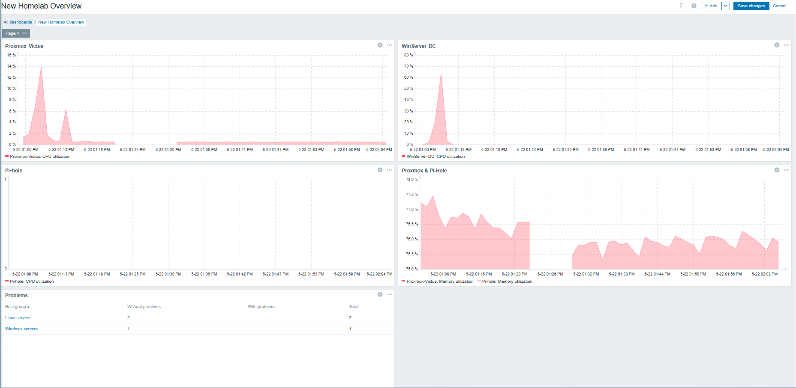
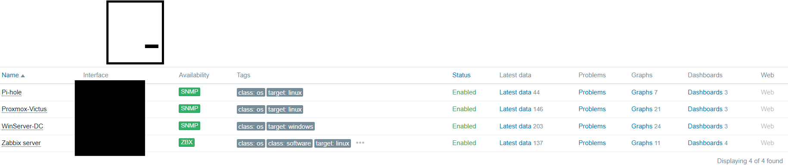

# Zabbix-Monitoring-Dashboard
deploy a Zabbix monitoring server in my Proxmox environment to watch over all my other infrastructure
## Objective
Deploy a Zabbix 7.0 LTS server to proactively monitor a mixed Windows/Linux virtualized environment and simulate MSP-style remote monitoring.

## Technologies Used
- Proxmox VE (LXC container, Debian 12)
- Zabbix 7.0 LTS (server, frontend, agent)
- MariaDB, Apache, PHP
- SNMP (Windows Server 2022, Debian Linux, Proxmox host)
- Discord webhook (future alerting integration)

## Hosts Monitored
| Host | Type | IP Address | Monitoring Method |
|------|------|------------|-------------------|
| Proxmox-Victus | Proxmox hypervisor | 192.168.0.xx | SNMP (Linux by SNMP) |
| WinServer-DC | Windows Server 2022 DC | 192.168.0.xx | SNMP (Windows by SNMP) |
| Pi-hole | DNS ad-blocker (Debian) | 192.168.0.xx | SNMP (Linux by SNMP) |
| TP-Link TL-SG108E | Managed switch | Removed | No SNMP support (documented limitation) |

## Implementation Steps

### 1. Container Setup
- Created a Debian 12 LXC container (2 vCPU, 2GB RAM, 10GB disk)
- Installed Zabbix 7.0 server, frontend, and agent via official repository
- Installed MariaDB and created the `zabbix` database with dedicated user
- Imported initial schema (required installing `zabbix-sql-scripts` package)

### 2. Web Frontend Configuration
- Completed the Zabbix web installer at `http://<container-IP>/zabbix`
- Resolved locale error by installing and generating `en_US.UTF-8`
- Fixed "connection refused" by disabling nftables firewall
- Added Apache alias to serve Zabbix content from `/usr/share/zabbix`

### 3. SNMP Configuration on Monitored Hosts
- **Proxmox host:** installed `snmpd`, configured `rocommunity public` and bound to `udp:161`
- **Windows Server:** installed SNMP Service via Server Manager, set community `public` with READ ONLY access
- **Pi-hole container:** installed `snmpd`, changed `agentAddress` from `Host IP` to `udp:161`, added `rocommunity public`
- **TP-Link switch:** attempted but found no SNMP support (Easy Smart switch limitation)

### 4. Host Registration in Zabbix
- Added each host with appropriate SNMP interface and template (`Linux by SNMP`, `Windows by SNMP`)
- Verified availability turned green for all three core hosts
- TP-Link switch removed due to lack of SNMP agent

### 5. Dashboard Creation
- Built a custom dashboard (`Homelab Overview`) with CPU utilization graphs for each host
- Added memory usage and network traffic widgets
- Configured Problem Hosts widget for at-a-glance health status

## Troubleshooting Highlights
- **Locale error on web setup:** installed `locales` package and generated `en_US.UTF-8`
- **Firewall blocking port 80:** flushed `nftables` and disabled the service permanently
- **SNMP timeout on Pi-hole:** changed `agentAddress` from `Host IP` to `udp:161`
- **Zabbix server failed to start:** schema file missing due to absent `zabbix-sql-scripts` package; installed and re-imported
- **Apache "page not found":** added `Alias /zabbix /usr/share/zabbix` directly to virtual host
- **TP-Link TL-SG108E has no SNMP:** documented limitation; switch removed from Zabbix

## Screenshots

## Resume Bullet
*Deployed a Zabbix monitoring server to track a mixed Windows/Linux virtualized environment, configuring SNMP-based health checks, custom dashboards, and automated alerts to simulate MSP remote monitoring workflows.*

## Author
Marc Mentor - https://github.com/MechaDMark/Zabbix-Monitoring-Dashboard
